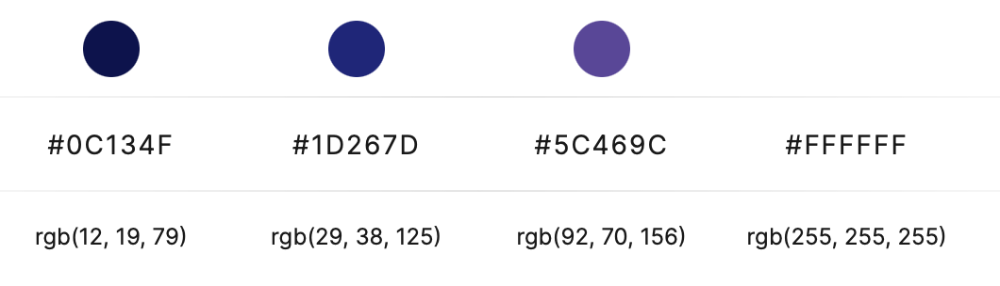

# Sounds Good v1.1

## Description

Sounds Good is a web application that allows you to search for different artists, albums, and songs and view details about them. On every song you can comment and view other users comments.

## Installation

The project is fully functional [here](http://it2810-23.idi.ntnu.no/project2).

If you for some reason want to use the application locally you can follow these steps:

Navigate to the Sounds-Good folder like this:

    cd Sounds-Good

Then run:

    npm install

Then finally to run the project:

    npm run dev

This will run the project locally on localhost.

**Note:** This will also use the backend that is hosted on the server. To use a local backend you have to change the ApolloClient URI in main.tsx to localhost, and start the backend manually:

    cd Sounds-Good-Backend

    node index

## Roadmap

- _V0.1_

  Date: 11. October

  Description: Should only be a visual representation of how we think the project should look. No backend.

- _V1.0_

  Date: 8. November

  Description: Get the app fully functional with a working database and backend connected.

- _V1.1_

  Date: 22. November

  Description: Improve the app and add other important things such as web accessibility and make the code more sustainable.

## Dataset

View our dedicated dataset documentation [here](/Sounds-Good-Backend/dataset-utils/README.md).

## Database

Since we already were going to use GraphQL instead of REST, we chose to make a Neo4j database. The reason for this is that GraphQL naturally supports graph databases like Neo4j. By choosing this database we avoid coding our own resolvers, and thus save a lot of time.

## Sorting and filtering

We have created a search where you first choose what category you want to search. Either artists, albums or songs. When searching for artists you have the ability to further filter the search by amount of listeners, which in reality means their popularity. When searching for albums you have the ability to filter by multiple tags. These tags are user-generated in the dataset, so some tags might only apply to one album and some tags might seem obscure. When searching for songs you can further filter by the duration of the song.

## Components

We have used [MUI](https://mui.com) to create some of the more complex components such as the navbar. For simple components, or components where we want to be more in control we make our own using just tsx and css.

## Global state management

We have chosen Redux for our global state management. We have not yet put it to use, but we will in the future.

## Web accessibility

Web accessibility is an important aspect of web development, because it allows everyone regardless of who they are to use your application. We have chosen to demonstrate the most relevant aspects of web accessibility in our app. To help us discover accessibility errors we have used a Google Chrome extension called [Wave](https://wave.webaim.org/).

Wave showed us that our constrast on the 'Show more' button was too low when we have white button text:


When we changed colors, it is clear that the button is much more legible because it has a higher contrast. Wave also doesn't complain anymore:


Wave also helped with discovering missing form-labels and ARIA-labels. It also helped with discovering heading level skips, which should should be avoided and is now fixed.

There is however some things that Wave can't check for such as keyboard accessibility. WCAG guideline 2.1 states: Make all functionality available from a keyboard. We had to check this manually. A lot of our components were wrapped in HTML div tags with onclick functions which made them work with a mouse, but not when navigating the page with a keyboard. We have now replaced a lot of divs with Link components from react-router-dom, which makes them keyboard accessible.

Here is a complete list of what relevant WCAG guidelines we have followed and a short description of how we followed them. (Note that some guidelines do not apply due too their irrelevancy. E.g. guidelines related to video content)

### Principle 1: Perceivable

- #### Guideline 1.1 Text Alternatives
  We have quite a lot of images of album covers on our website. All of them have been given an alt-text.
  <!-- - #### Guideline 1.3 Adaptable
    The content of the website can be viewed horisontally (such as on a laptop) or vertically (mobile device). We have also achieved adaptability by concious coding of headings and such. -->
- #### Guideline 1.4 Distinguishable
  We have achieved this guidline by the use of sufficient contrast. Making it easy to distinguish the foreground from the background.

### Principle 2: Operable

- #### Guideline 2.1 Keyboard Accessible
  All functionality on the website is accessible through the keyboard. Mainly by using the tabulator, but also the arrow buttons and spacebar to select between options in radio buttons and drop-down menus.

### Principle 3: Understandable

- #### Guideline 3.1 Readable
  The language of the page (english) is specified in index.html

### Principle 4: Robust

- #### Guideline 4.1 Compatible
  We have used ESLint to ensure that our code is free from errors. This is to ensure robustness and compatibility with most standard browsers.

## Sustainable web development

Sustainable web development in a topic that is gaining increasing importance. We have chosen to focus on UN's sustainability goals, 12: Responsible production and consumption and 13: Climate action. These goals are tightly tied together, as responsible production and consumption will help in taking climate action.

To make our website more sustainable we chose to split up our search into three different categories, namely an artist search, an an album search and a song search. Our original plan was to make it possible to search for everything all at once. However, we let sustainability influence us to choose differently. By splitting up the search into different categories, the query only gets data from one node in the database, making it computationally simpler, using less power and thus more sustainable.

Currently we do a query on every keypress in the search. We considered switching to searching on pressing "Enter", but since we do not have all the songs in the world we found that getting results was more difficult when you couldn't see them during typing. This of course comes at a cost considering sustainability, but we felt that the user experience was more important.

Pagination also plays a big role in sustainable web development. By only retrieving a few pieces of data at a time, the amount of data sent for every search is reduced by a large amount. Less data traffic means that less power is needed, resulting in a more sustainable website.

We have also taken sustainability into account when showing images on our page. All the images are 300x300 px which is a size that we felt was a good balance between having a good quality image while not having excessive image quality. This again goes back to reducing the amount of data that is being transmitted.

Another thing we did was to change our color palette. Dark colors uses less energy than light colors, so we decided to go for a darker color palette, to align with our sustainibility goals. Here you can see our color palette:



## Testing

We have done both end-to-end testing and component and unit testing. E2E testing is the most relevant because it actually tests use cases. The component and unit tests is mostly so see if components render correctly and that functions function as intended.

### E2E testing

We used Cypress to make and execute an automated End-To-End test that would test the functionality found in the application. We decided to have all the tests in one file to make it easier for others to run the test smoothly. An alternative would be to have the tests in separate files that would correspond to different user scenarios.

The testing covers all of our functionality, that being filters, sorting, search and commenting on songs. We additionally have some testing that makes sure the different pages and components render correctly, given a user action. It should also be noted that we only test alphabetical sorting once, even though it is a reoccurring feature. This is because any more of those tests would be redundant.

To run the Cypress test, you need to be in the "Sounds-Good" repo and write the following command:

```
npm run cypress:open 
```
Remember to run this command if you have not done it earlier:

```
npm install
```

Once you have run the command to open Cypress, you should be greeted by this window:


Press the "E2E Testing" option which will lead you further to another screen:


Here you can choose which browser you want to run the E2E test on. We highly recommend choosing Google Chrome or Firefox, as these are definitely going to run the test. Note that for Mac users, the Safari browser will not be recognized. After you have chosen a browser, a new browser window will open with a new interface:


You will now have to choose which test to run, which in our case is only one. After you have clicked on "E2E.spec.ts", the test will start and you will see the results:


To close Cypress, you only need to go back to the terminal where you started it and press the keys "CTRL + C".

### Component and unit testing

We have used Vitest and @react-testing-library to do component and unit testing. Each test is found in the same folder as the corresponding component.
To run these tests, write the following command when you are in the Sounds-Good directory:


```
npm test
```

Remember to run this command if you have not done it earlier:

```
npm install
```
## Discussion

For _V1.0_ we have set up the database, deployed the backend and further developed the frontend. We have generated a dataset by making API calls to the last.fm open API. From this we got JSON data, which we generated a graphDB with nodes and relations.

The webpage is still centered around the homepage. Here it is possible to search for either artist, album or track. There is a filter which configurates search category that can be picked both before and after search. It is also possible to filter on tracks by duration in seconds. There is also functionality to sort search result either ascending or descending alphabeticaly.

We wanted to be able to filter on all three search-categories(artist, album and track), but we had alot of issues dealing with MaterialUI components and the graphQL query language, and were only able to filter the track category by duration. We have filter components in FilterComponent -> subcomponent mostly done and will develope these further.

All in all, we have a large dataset and there is a lot of database content to view on the site.
